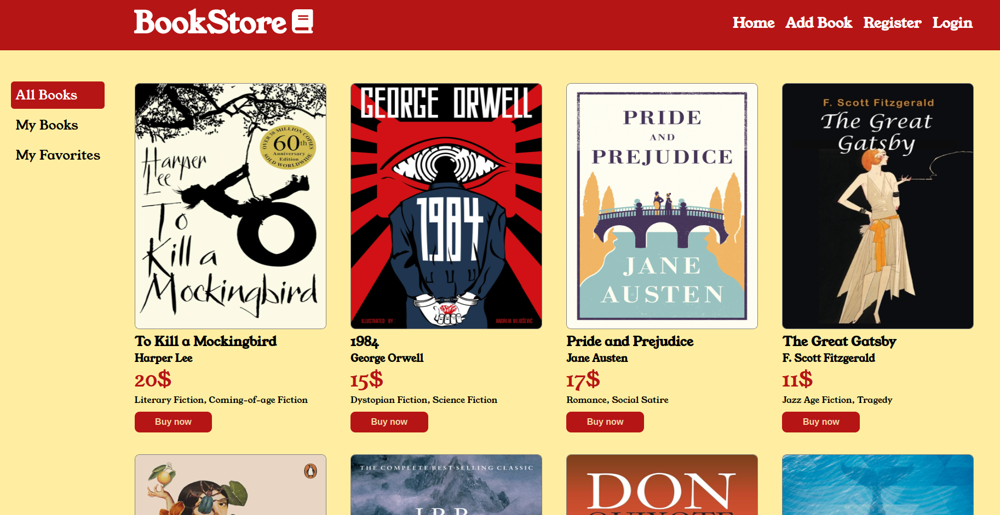
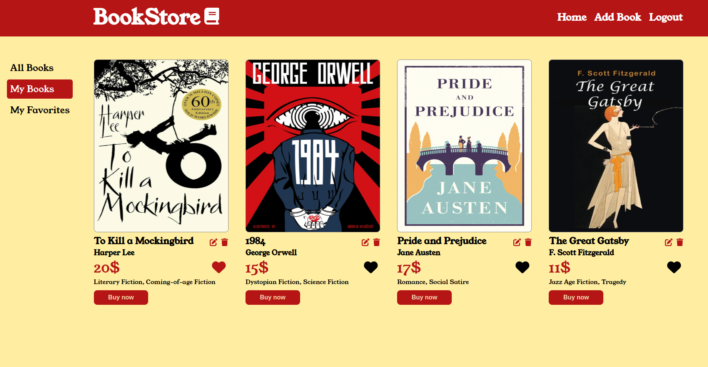

# Bookshop Fullstack Project

Welcome to Bookshop, where your love for books meets a user-friendly platform! This full-stack application is designed to make your reading and selling experience enjoyable and straightforward.

## Screenshots

## Project Overview

### Introduction

Bookshop is your go-to place for exploring, selling, and organizing books. Whether you're a reader or a seller, this platform offers a simple and personalized space to connect with your favorite literary treasures.

### Features

- Discover Books: explore a variety of books as soon as you land on the platform.
- Register and Log In: create an account or log in for a personalized experience.
- Sell Your Books: easily add books to sell and manage them in the "My Books" section.
- Edit and Delete: edit and delete books that you've added, all in one place.
- Favorites: like books to create a personalized collection in the "My Favorites" section.

### Technologies Used

The Booklists project is built using the following technologies:

- Frontend: React (Vite)
- Backend: Node.js (Express)
- Database: ORM (Sequilize)
- React-router-dom library
- CSS
- HTML

## Getting Started

To get started with the Bookshop project, follow these steps:

1. Clone the repository.

### Backend
2. Navigate to the folder `cd bookshop`, `cd server`.
3. Install the necessary dependencies `npm i`.
4. Run the application `npm run dev`.

### Database
5. To fill in the database with books you can use data from `booksData.txt`.

### Frontend
6. Navigate to the folder `cd client`.
7. Install the necessary dependencies `npm i`.
8. Run the application `npm run dev`.
9. Go to `http://localhost:5173/`.

## How to Use

1. Explore Books: discover a collection of books.
2. Create an Account: sign up or log in to add the books to sell.
3. Sell Your Books: add books to sell and manage them in your personal "My Books" section.
4. Edit and Delete: edit and delete books you've added in the "My Books" section.
5. Favorites: like books to build your collection in the "My Favorites" section.

## Possible future improvements
- Typescript
- Improve the login system
- Add "Buy" functionality
- Deployment

